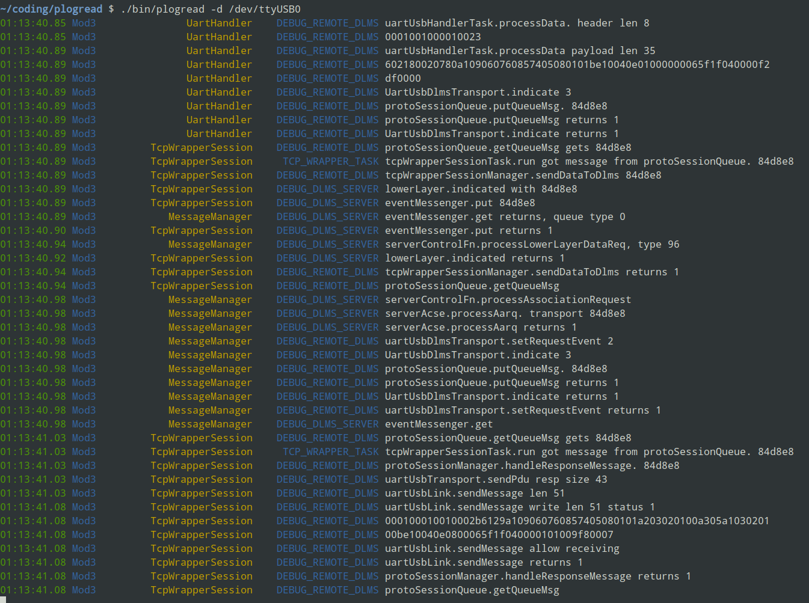

# plogread
Picasso Log Reader

## Installation

  1. Install NodeJs in your OS.
  2. CD into the root directory of this package.
  3. Run `npm install` to install dependencies.

## Usage

The following command line read and print the log, in the same time it save all the logs to a file.

  - Linux: `./bin/plogread -d /dev/ttyUSB0 -w log`
  - Windows: `node plogread -d COM3 -w log`

For detail information, run `plogread -h` to get the online help. Below is a
screenshot when running the above command line:

